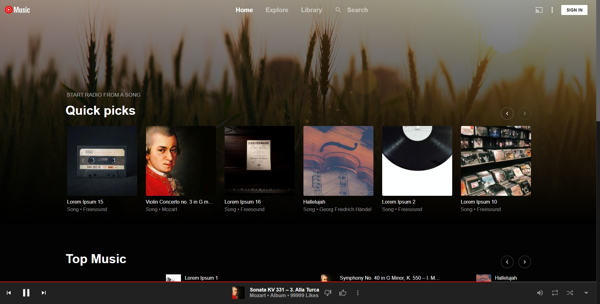
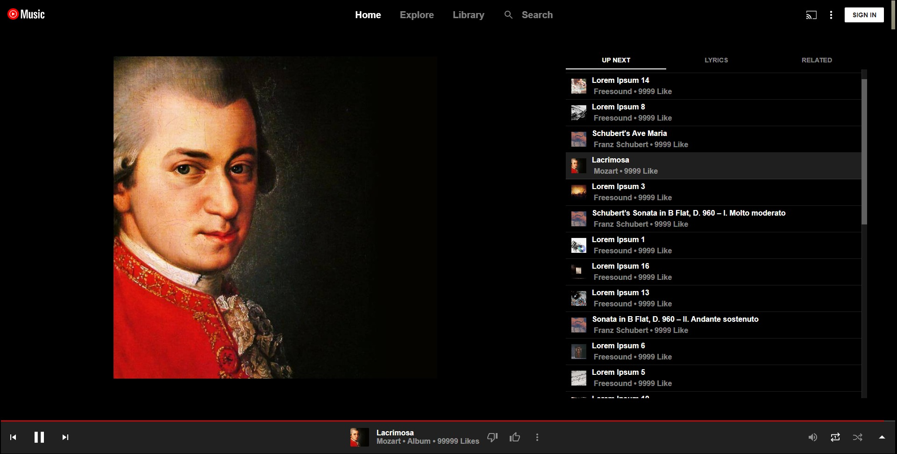
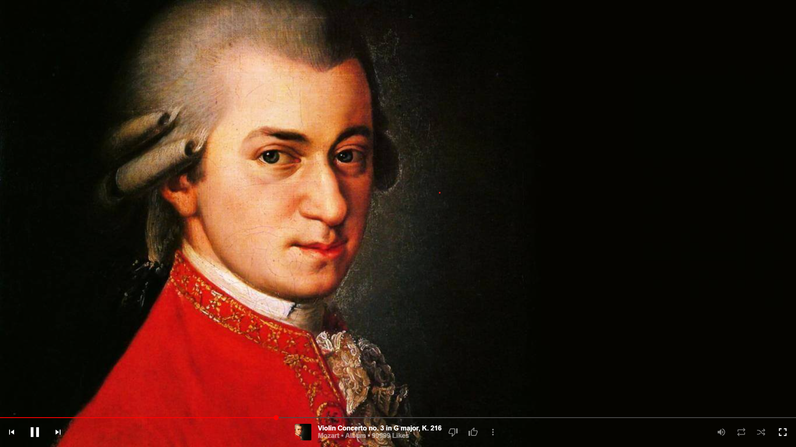

# Youtube Music Clone







[Live](https://ytmusic-clone.netlify.app)

## Technologies

- react
- react-full-screen
- react-range
- react-router-dom
- react-use
- redux

## Project setup

### Install packages

```bash
npm install
```

### Run the app in the development mode

```bash
npm start
```

Open [http://localhost:3000](http://localhost:3000) to view it in your browser.

### Compiles and minifies for production

```bash
npm run build
```

### Songs

[freesound.org](https://freesound.org/)

[chosic.com](https://www.chosic.com/)

### Photos

[Pexels](https://www.pexels.com/)
